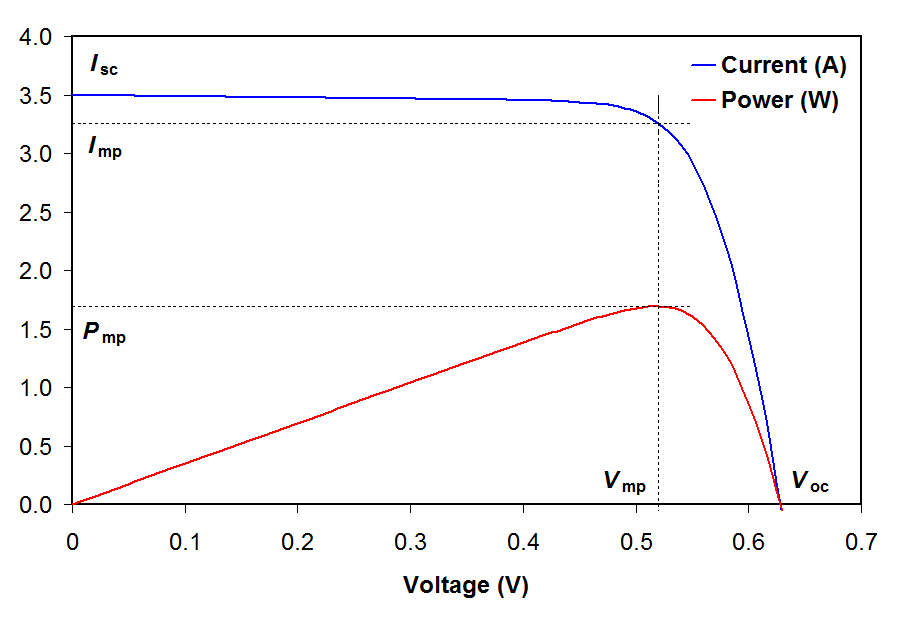
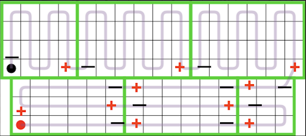

# CalSol Electrical Workshop
## Lab X: Solar
* Learn the basics of how solar cells work 
* Solder solar cells

## Introduction
This lab will go over what you need to know to get started on solar projects.  

## THE LESSON
### Section 1: Background Information
Photoelectric effect:
* Main principle of making solar cells work
* Photon (must have energy greater than the band gap) excites an electron from valence to conduction band
* This creates an electron hole pair, and thus adds free carriers to the system
* After a photon has sufficient wavelength to excite the cell, increasing number of photons increases power generation (photon downshifting can make use of higher energy photons by turning them into multiple lower energy, but still sufficiently energized, electrons, but that is beyond the scope of this discussion.)

How a solar cell works::
* Generation → Separation →Transport 
* Generation: from the photoelectric effect; light is absorbed and excites electrons; creates free carriers
* Separation: the free carriers need to stay separated, recombining is bad
* Transport: current flows through the material and through the load
 

Types of solar cells:
* We use SunPower’s 23.7% efficient monocrystalline silicon solar cells
* Monocrystalline is more efficient than polycrystalline (electron flow over grain boundaries is inefficient)
* GaAs is expensive, but more efficient because of doping (see group 14 of the periodic table)
* Silicon is quite brittle; can’t curve to fit a really nice aero shape
* We also want to maximize the sun exposure, so staying flat is a plus (although we have microscopic structures in the encasing of the cells to redirect light and reduce the effects of contact angle to minimize these effects)

### Section 2: IV Curves and MPPTs
What is an IV curve?
* Solar cell performance is characterized by an IV curve
* The IV curve essentially demonstrates the output current of the solar cell as a function of various load voltages
* Different factors can alter both the shape of the curve and its intercepts
* Goal: get the maximum power (where P=IV) from the solar cell
* On the IV curve, the power output at any given point is the integral of the curve
* Components of IV curve
* Voc: open circuit voltage
* Isc: short circuit current
* Isc varies based on the amount of solar radiation
* Max power point: point on the curve (a specific (V,I) pair) where P=IV is greatest (in other words, where the integral is greatest
* Fill factor (FF): the ratio of the power at a given point to the maximum theoretical power, which is given by Voc  x Isc (see diagram)
* The efficiency of a cell is given by the max power over the input solar irradiance

IV Curve Tester: we have two! One in Supernode, and one at the RFS need to go to the RFS and test during the day
* Before integrating panels onto the car, we need to test them using the IV curve tester 
* The IV curve tester attaches to the positive and negative leads of the solar cell
* The tester then does a “voltage sweep,” where it tests the output current at different voltages

MPPTs:
* MPPTs (Maximum Power Point Trackers) are DC-DC converters, and they serve two main purposes:
* Find the maximum power point in the changing conditions of the cells.
* Regulate the voltage to help charge the batteries
* The optimum battery voltage may be different than the Vmp (voltage at max power), so the MPPTs can alter voltage to account for this.

Practice Problem!
Based on this graph, give the Voc, Isc, Fill Factor, Vmp, Imp, Pmax, and efficiency of the cell for each curve given the input power labeled and a (hypothetical) cell area of 2 m2.

### Section 3: Array Wiring

* The array is split into sub-arrays, each of which has approximately the same amount of voltage 
* Each sub-array (represented by a different colour) is connected in parallel

* This diagram shows the wiring of the top subarray 
* The purple lines indicate the internal wiring of each solar panel
* In order to connect the solar panels to each other, we will solder flat wire to the tabs on each solar panel

Bypass diodes:
* All of the cells in a sub-array are connected in series, meaning the current that goes through all of the cells is the same. If one cell is shaded or damaged, the current through it will decrease. To prevent the whole output of the sub-array from being affected, the bypass diode allows the current to be diverted away from the shaded/damaged cell. 
* Ideally, we want to have a bypass diode for every 4 cells (the small squares in the above diagram) however we are limited by the internal wiring. If the panel is completely internally wired, we can only connect 1 bypass diode across the panel. 

### Section 4: Wiring Panels

Handling solar panels:
* Solar cells are brittle - avoid bending them
* Pick them up by the corners
* Clean them with IPA, NOT Acetone

**[IGNORE FOR TODAY] Solder a solar panel:**
* Work in groups of 2 or 3 and get a spare solar panel 
* Make 2 pieces of wire
* Cut 2 pieces of approximately 7 inch length flat wire
* Wrap in one layer of kapton tape (electrically insulating)
* Wrap in one layer of tesa (abrasion resistant)
* Solder each to the tabs on the panel
* Try to limit the amount of time you keep the soldering iron in contact with the cell
* Use a soldering iron with a chisel tip (thicker than a regular tip)
* Cover join with a piece of kapton tape
* Use a multimeter to identify which wire is positive and which is negative
* Wire with bypass diode
* Use a multimeter to measure how much voltage is being output 
* Now shine light on the cell and remeasure the voltage. What do you observe?

## Conclusion
You are ready to start working on a Solar task. 

